# UAL Summer Study Abroad: Creative Computing Daily Reflections by Amy (Eunjong) Lee 

## Day 1 (2026/06/29)
  

## Day 2 (2026/06/30)
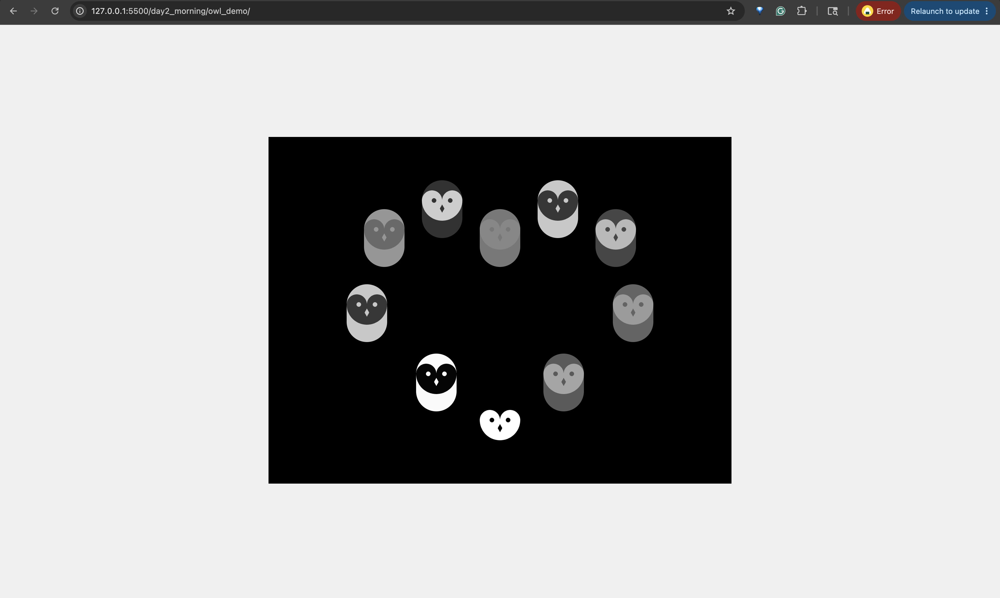 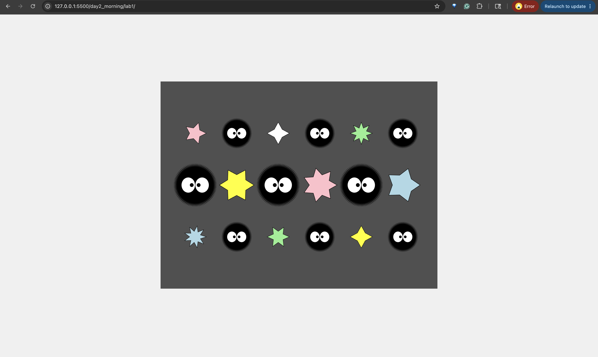

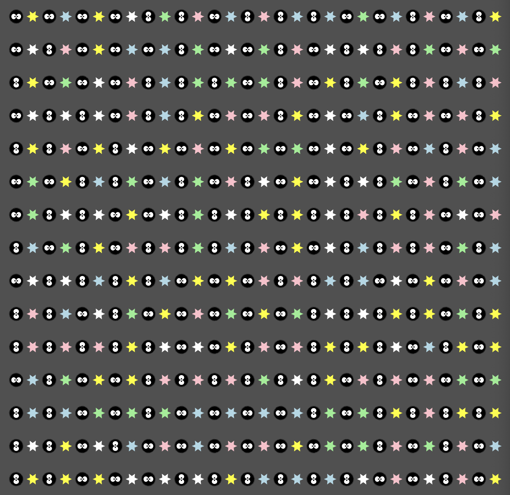 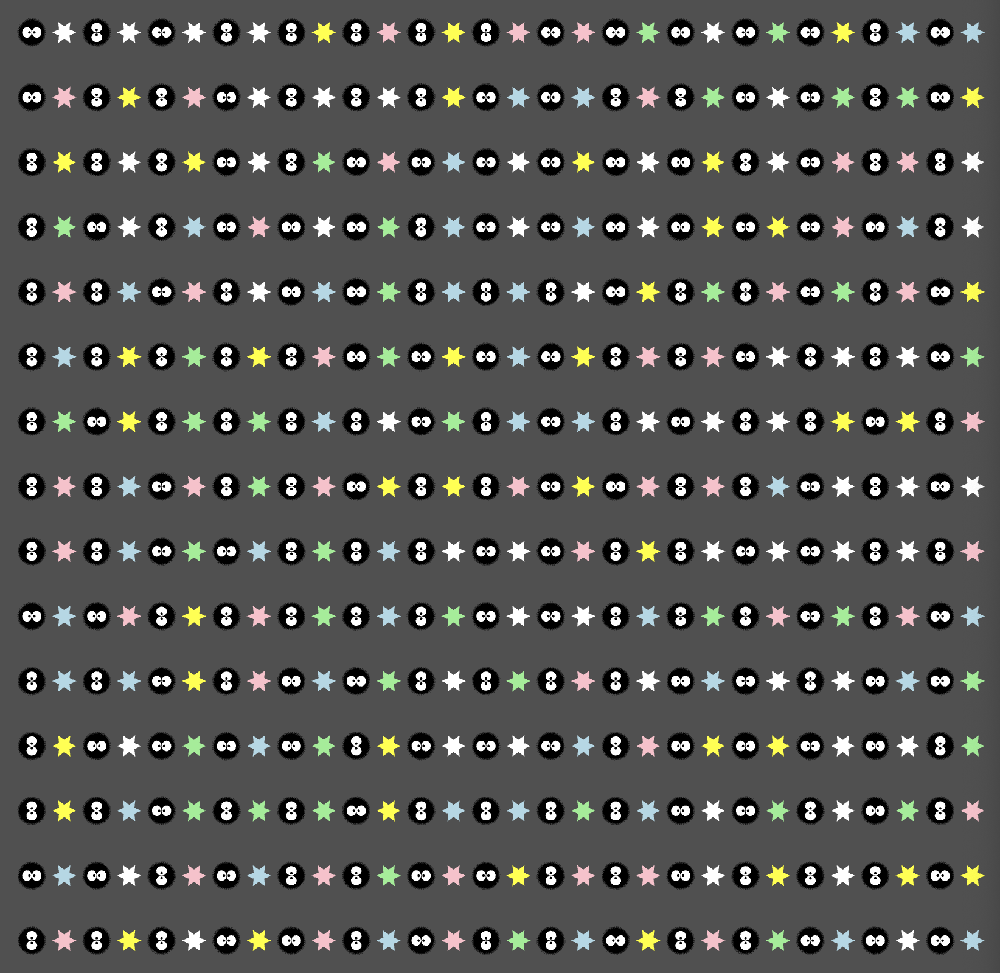

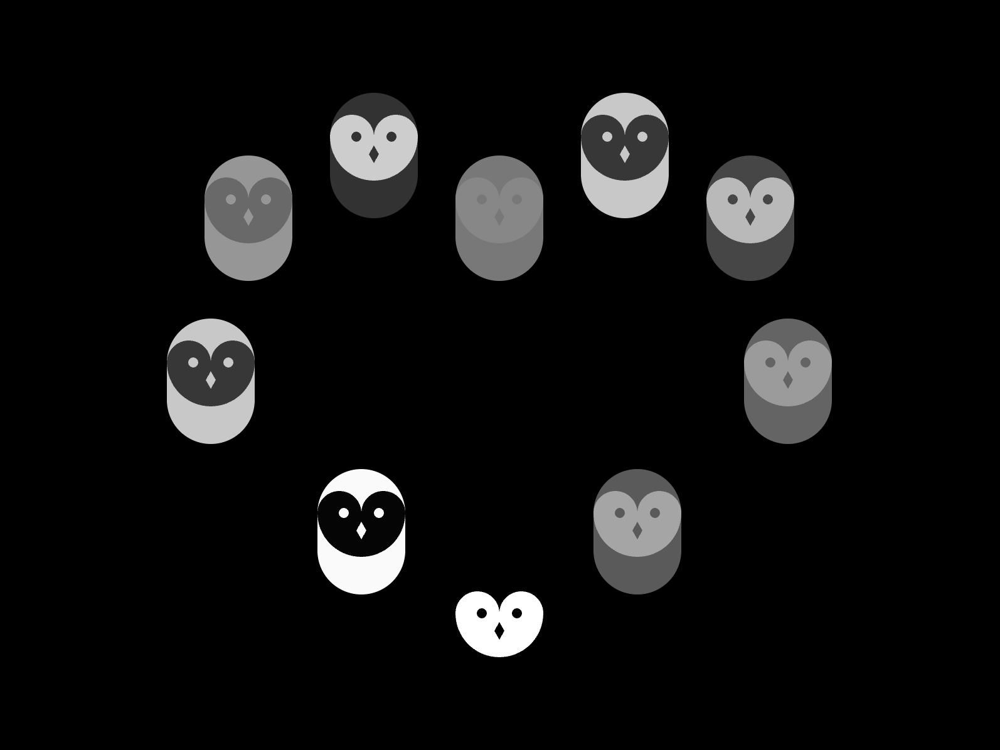 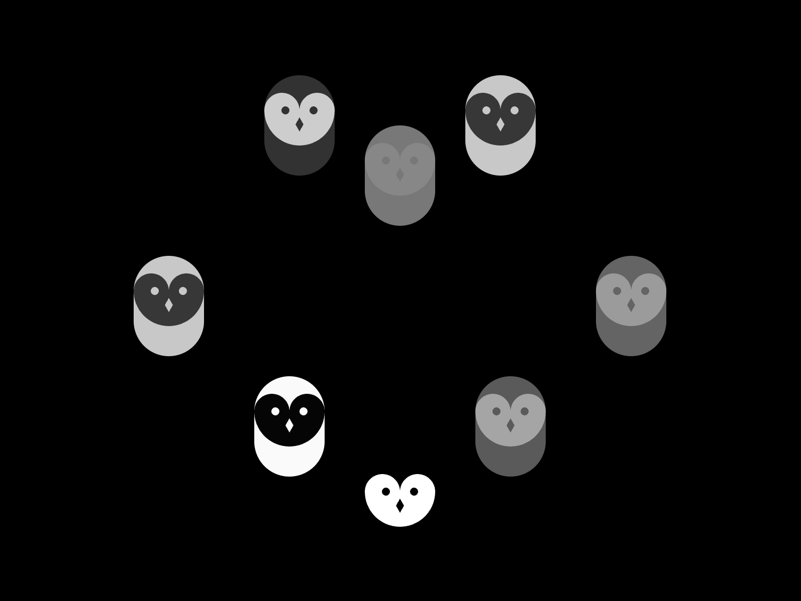 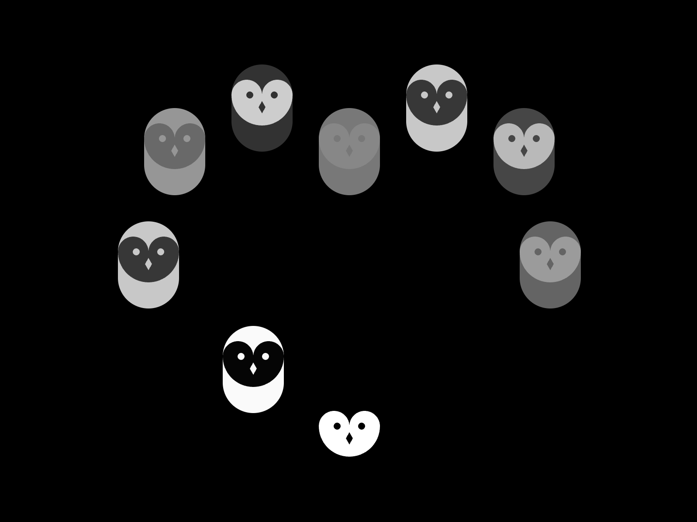

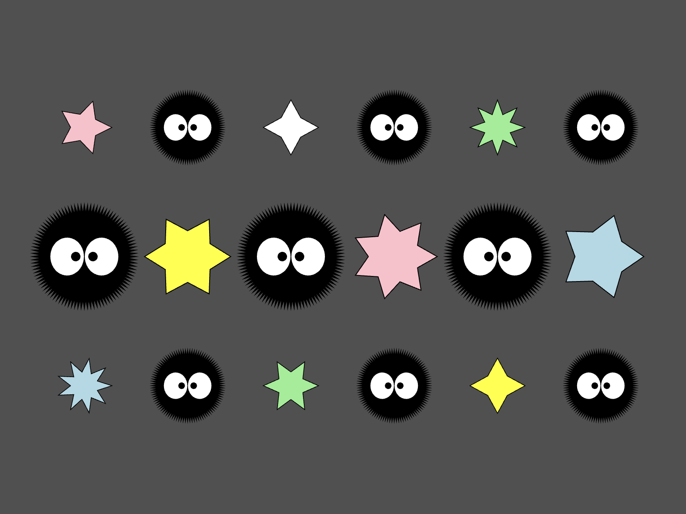

## Day 3 (2026/07/01)
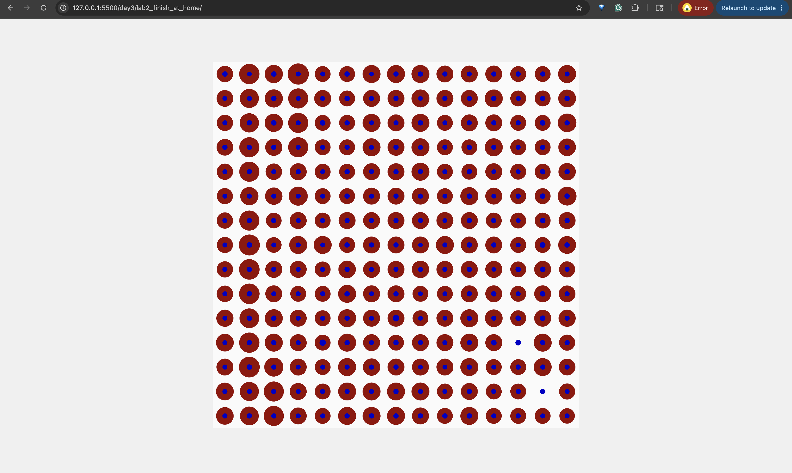 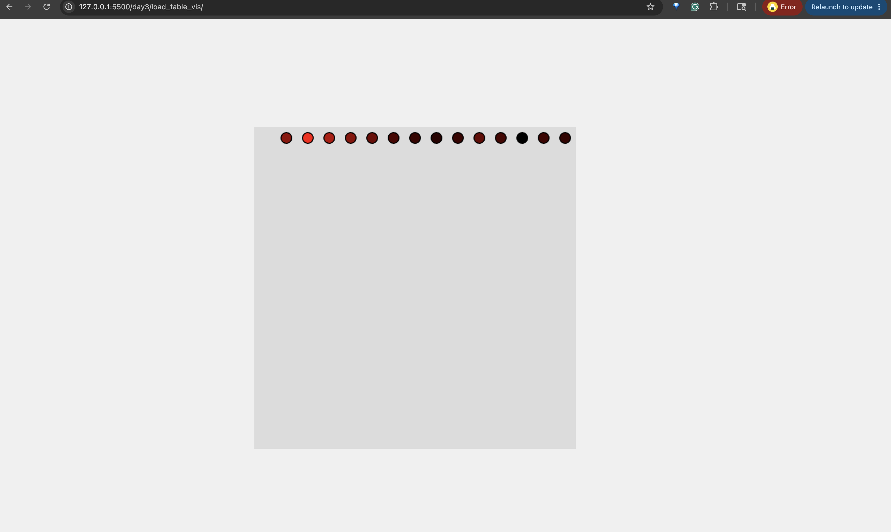

## Day 4 (2026/07/02)
 

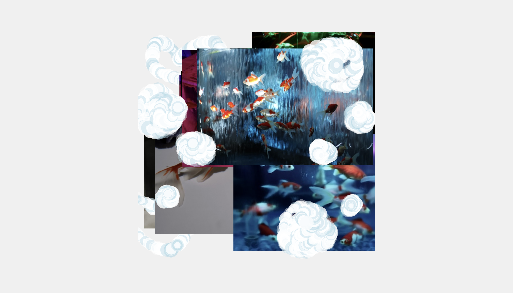 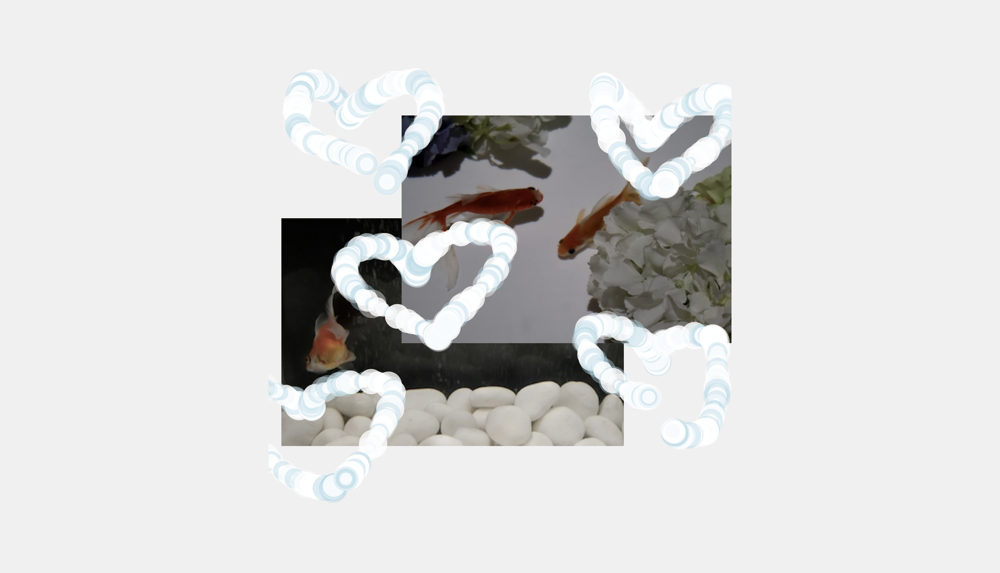

## Day 5 (2026/07/06)

## Day 6 (2026/07/07)

## Day 7 (2026/07/08)

## Day 8 (2026/07/09)

## Day 9 (2026/07/13)

## Day 10 (2026/07/14)

## Day 11 (2026/07/15)

## Day 12 (2026/07/16)
