# UAL Summer Study Abroad: Creative Computing 
Daily Reflections by Amy (Eunjong) Lee 

## Day 1 (2026/06/29)
   

Though it was my first time using Visual Studio Code, it wasn't too difficult to follow along since I had prior experience with Processing and was familiar with GitHub.

Based on my one-day experience of Processing, from a workshop conducted by artist [Jiho Park](https://www.jihopark.net/), I wanted to try more advanced prompts to depict a personal story.

I found a [rotateY();](https://beta.p5js.org/reference/p5/quad/) code that inspired me to create a kinetic portrait. I tend to switch up my makeup and style every day; thus, different people have told me that I look like different people. For example, friend A might say I look like celebrity X, while friend B might say I look like celebrity Y. I found it interesting that people realize various things within one face (me).

My portrait attempts to display this by having the pupils, eyes, nose, lips, and blush continuously change in colors and/or sizes, utilizing the random(); function. My two beauty marks remain static within the quick-changing environment, hinting that despite the changing features, this is still my face.

The biggest challenges I faced included finding the right shape for the hair and figuring out the grid for my eyebrows. I wasn't familiar with the arc(); function; thus, I had some trouble translating my hair onto a 2D canvas. I would have preferred to have a changing hairstyle. In addition, the quad(); code I used to draw my eyebrows was also quite strenuous to use, having to set four parameters for each vertex of the polygon. I still prefer analog methods of working through mathematics: using a paper and pen to draw and write out equations. Hence, understanding the p5.js coordinate system took some time.

## Day 2 (2026/06/30)

Learning about custom functions, loops, and arrays allowed me to create more complex and developed drawings in a more organized way. I found the textiles and loom examples especially interesting because I always saw similarities between objects related to computer/robotics and textiles. Working with Arduino, I like to see patterns within my jumper wires: the way they intertwine and mix, just like yarn or threads in textiles. In addition, I like to call a flat textile work a screen. Just like how my phone or computer screens are made of pixels, so many tiny pieces of color work to make a patterned whole in textiles. Surprisingly, I haven’t tried coding a textile pattern yet, so the exercises were very intuitive. 

  

I altered the owl_demo sketch so that the owls would appear and disappear in a heart shape. At first, I was simply practicing to familiarize myself with the p5.js coordinate system--something I was struggling with the day before. Then, I wanted to animate the static image. I asked an AI tool which function would be best suited for this. Although it gave me a code that smoothly faded the owls in and out, I wanted to stick with and play with functions I learned in class that day, so I used the if-else statements instead.

 

Lab 1: Again, I was playing around with the coordinates to create an interesting binary pattern. The [dust characters](https://en.wikipedia.org/wiki/Susuwatari) were originally simple circles. However, after learning a [star();](https://archive.p5js.org/examples/form-star.html) function, I replaced the circles to better depict the actual characters' furry texture.

 

Lab 3: My main goal was to utilize the grid and translate(); features. In an attempt to advance from the methods I used in class with Lab 1, I incorporated count, spacing, and offset to efficiently produce an evenly spaced drawing instead of manually specifying each coordinate. I reused the shapes I made back in Lab 1, as I really liked the outcome. Originally, I only had the stars changing colors with the random(); function. However, over the week 1 weekend, I revised the code to have the dust characters rotate like the triangles in the anni_albers_sketch. Below is the final final sketch.

 

## Day 3 (2026/07/01)
  

I was inspired by an artwork, the [*Stress Inventory* by Laurie Frick](https://www.lauriefrick.com/stress-inventory). Combining skills from the previous two days, I wanted to utilize draw(); polygons, and practice organizing my drawing with grids. However, the process was much more complicated than what I had expected. 

The data CSV I chose (water quality) to work with had some missing data at random places. I worked with an AI tool to come up with a code that would identify these "holes" so that my code would check for valid data before use. Figuring this part out took the longest, as the other processes, like establishing a grid and drawing circles, were familiar actions. 

Larger red circles mean higher pH values. We could try to interpret this: too acidic or too alkaline water wouldn’t be ideal for aquatic life. Thus, circles not too big or not too small would indicate healthier water. 

Blue circles have their diameter based on Secchi values: how clear the water was. Higher Secchi values, or bigger blue circles, mean clearer water, which we can infer is generally better quality water. 

The yellow circles; however, are based on salinity values. We cannot tell much about water quality, as salinity is much more contextual compared to the previous two parameters. I added them over the week 1 weekend as a cherry on top because the drawing felt a bit boring. 

This drawing wasn’t really made to be informative. But, looking at it for long enough, it kind of feels like an optical mixing drawing. 

I also uploaded all my screenshots today and came across errors in the Terminal: some diverging branch problems. I am saving the codes I used here for myself. 

git pull origin main --no-rebase
:wq
git push origin main

## Day 4 (2026/07/02)

Lab 1: In class, I started by figuring out how to load different images so the user can interact to control which photos are displayed. I had a basic code that loaded the image files at random places and a drawing tool to decorate the collage. 

 
 
*Self-taken photos used*

Lab 1: I edited the image files so they would look more like a collage when put together. Keeping the drawing tool and random location feature, I added a randomSize(); feature to make the picture more interesting. The bubbles were inspired by content I found online: a code Google Gemini summarized. However, there were many functions that I didn’t know of, including class, constructor, and float. The code is included in my Day 4 folder named bubble_from_online. Again, I didn’t want to work with an AI-produced code that I cannot follow along with; I did, however, learn about an opacity option in fill(); 

 

Lab 2: 

## Day 5 (2026/07/06)

   
  
    

A series of creative applications of AI. A brief review of my exploration, corresponding to the order of screenshots.

- [Splash Canvas](https://artsandculture.google.com/experiment/splash-canvas/vQFCtQB7FDnYkA?hl=en): Here I tried to draw until I kind of agreed with what the squids were guessing. I appreciate how they tried to find meaning behind my thoughtless drawings.
- [Infinite Drum Machine](https://experiments.withgoogle.com/ai/drum-machine/view/): It felt like an anything-can-be-music example, something that used to be a trend back in the day. The mapped-out interface was interesting; again, I wonder what patterns the AI noticed to group the sounds like that.
- [ILA: Recurse Mix](https://infinite.mothquantum.com/): I was actually not too sure what functions were going on except that the image was being distorted with square-like blurs appearing what seems to be randomly. It reminded me of some grouping method that is used to recognize patterns within an image to group pixels and reduce file size.
- [Suno](https://www.suno.com): I see great opportunities within this AI tool: those who don't have the money to buy music equipment or the skills to create music from scratch could benefit from SUNO. I used it to create [something](https://suno.com/s/oyCoTEfCzdEFYdqZ) that sounds similar to what I have been listening to on loop recently, as the Spotify magic suggestions didn't do the job. Above are the pros, I anticipate with AI music, as there has been controversy regarding it with the trend of "GG EZ" by M.Sasuke.
- [Emoji Scavenger](https://archive.google/emojiscavengerhunt/): I found the miscommunication quite funny. Similar to how the Little Prince saw a snake swallowing an elephant instead of a hat, the guesses made by the AI make me wonder exactly what pattern or form made them think that. It felt like interacting with someone from a totally different background who does not speak any of the languages I speak. 
- [Teachable Machine](https://teachablemachine.withgoogle.com/): That I can make a personalized model excites me, as I have seen recent young artists using image detectors. For my experiment, though, I found it intriguing that the model fails to guess number two the most when I had fed it more images of two.
- [Even Stranger Things](https://evenstranger.pw/): Nothing much happened except classification and the same filter or graphic being placed on top of the images I uploaded.

A thought has always bothered me since I declared Art and Computation as my major. Whatever I make, it is already on the internet and usually in a better form. I am a beginner, so it makes sense: everyone starts with color charts and shading polygons. Because we have been practicing basic p5.js, making projects without much story or intent, I haven't been a fan of what I have made so far. This project, however, made me feel like I was making something more meaningful as I could add more context behind my code.

  
[Online Editor](https://editor.p5js.org/leechaeing/sketches/v_rZYQ75U)

Noonchi is a Korean word that reflects much culture, making it hard to translate into other languages. I am someone who uses a lot of noonchi to detect someone's mood. It may be disrespectful to declare someone's feelings; however, we do this to avoid conflict and care for another. Text and screens act as barriers, making it harder to guess others' moods: nuance, tone, etc., are also important factors to consider. I made a filter for users to announce their moods. I only have two moods as of now: sad and happy. By clicking the sad button, users can control the number of tears, showing the depth of their feelings. The happy button resets the tear counter and tracks the nose location to draw stars at random locations. There is also a textbox so that users can communicate their states.

Some difficulties I had were coding the blinking and mouth-opening features. I asked an AI tool how I should go about this, and it suggested using the ears to help calculate whether the eyes were closed by frame. Unfortunately, I could not make a code that worked. The code itself didn't seem to have much issue; rather, the API seemed to identify my eyes as nearly closed even when they weren't. I tried to utilize the mouth so that tears would be added when you open your mouth. Honestly, I was discouraged by the difficulty and the fact that adding tears by opening your mouth did not feel convincing.

A thought I had since the first session: What would be a difference between motion graphics and generative art? In what situation would you choose one method over the other?

## Day 6 (2026/07/07)

Listening to the lecture I had a question in mind: there are different ethics for different positions like user ethics, designer ethics, etc. But, can we “teach” computer ethics? Would there be computer ethics (ethics that computers must follow)?

     

In-class explorations: 

[doodleNet](https://editor.p5js.org/ima_ml/sketches/0KtSHucVH)
- Classifier variable to bring in DoodleNet Classification ml5 
- resultsP variable to communicate what it has classified and how sure it is 

[imageClassifier_webcam](https://editor.p5js.org/ml5/sketches/K0sjaEO19)
- Classifier variable to bring in the ml5
- Video variable to use webcam 
- Label variable to communicate with code via text 
- Video becomes input and label shows output (what ml5 reads) 

[Drag and drop](https://editor.p5js.org/codingtrain/sketches/v1sAlvSHR)
- Classifier variable to bring in 
- Img variable for image input 
- Label and confidence variable for output and communication 

[Teachable machine](https://editor.p5js.org/ml5/sketches/VvGXajA36)
- Url + model.json
- Preload to ensure everything OK before setup     

  
My slides from the [Group Presentation](https://canva.link/tvf8i7b7sfbemqp).

Notes from research: 

3. (in the inferface) are there any warnings of safeguards?
- Yes; safeguards team; enforces in real time
- Usage policy (Acceptable Use Policy)
- Universal Usage Standards: for all users and use cases
- High-Risk Use Case Requirements: consumer-facing use cases posing elevated risk of harm
- Experts for legal, healthcare, insurance, finance, employment/housing, academic testing, accreditation, admissions, media/professional journalistic content
- Additional Use Case Guidelines: consumer-facing chatbots, products serving minors, agentic use, Model Context Protocol servers 
- Evolving framework: Based on physical, psychological, economic, societal, individual autonomy
- External partnerships: Experts in policy, enforcement, product, data science, threat intelligence, engineering, terrorism, radicalization, child safety, mental health

e.g., Partner with ThroughLine for self-harm and mental health situations
- usersafety@anthropic.com: users can report 
- Safety evaluations, risk assessments, bias evaluations before releasing new model
- Real-time detection and enforcement: Classifiers 

4. Do you believe the policy is sufficient for an ethical approach?
- Their attempts to making an ethical approach lead to encroachment of other ethical properties
- Lack of exposure to protecting privacy 
-  Lack of environmental issues

  
OpenAI ChatGPT based on GPT-5.5 and Anthropic Claude Sonnet 5 (conversation model) used to generate the images, respectively.  

I used the same prompts to see what various AI models would give me. I thought it would be interesting to compare and contrast how different AI tools process differently. I have only used OpenAI's ChatGPT and Anthropic's Claude (MidJourney in Discord as well), but I didn't want to use other AIs that I wasn't familiar with. Even for everyday tasks, I rarely use image generation features. The image generation features sparked much conversation at my school, and just the process of waiting for an image to be created stresses me for some reason. Personally, I prefer the diagram Claude generated. I have never been a fan of realism; thus, whether it'd be a human or computer producing a realistic image, it is not my favorite. I purposefully wrote "college dorm" to hint at the atmosphere, but I don't think it was communicated effectively. The image feels too cozy, warm, and home-like. By college dorm I meant something more cold and fleeting. The furnitures do not belong to me and I have little control over interior. I wonder what ChatGPT took in by "college dorm". 

## Day 7 (2026/07/08)

 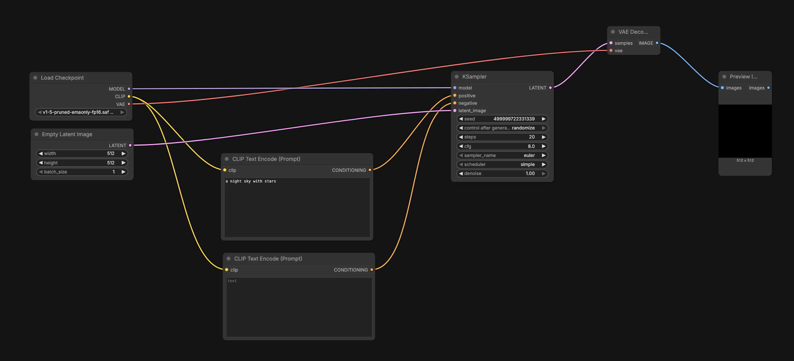
Black screen image error.

I had an error that would only give me black screen images. It was definitely not a hardware problem, and Marysia suggested I manually download ComfyUI and open it through the terminal. This also had the same error initially. 

 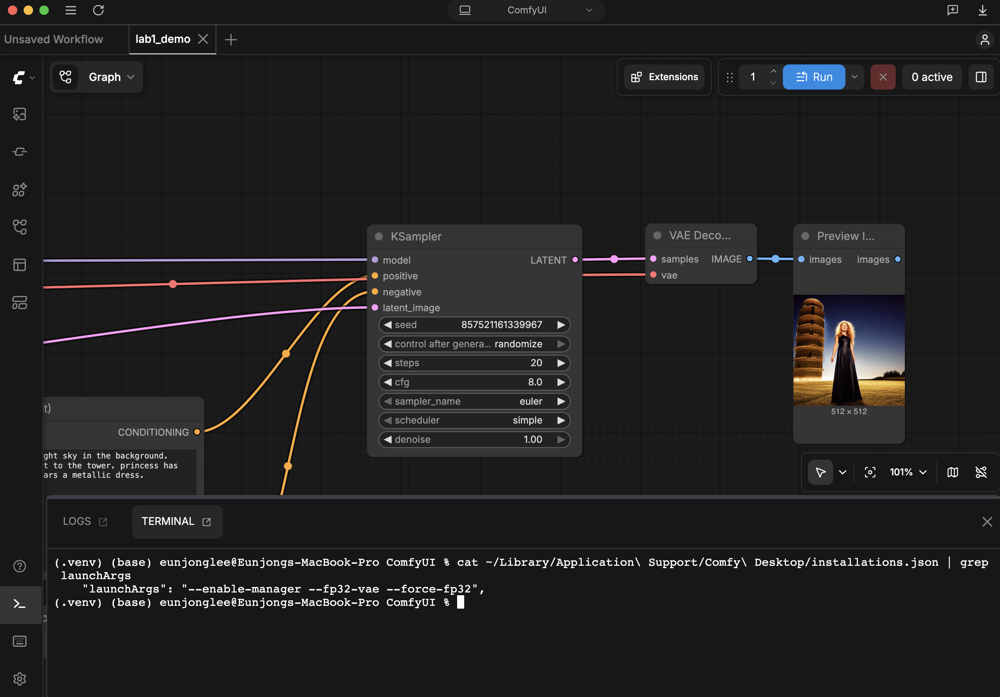 
ComfyUI via Terminal and Comfy Desktop, respectively.

Using the CPU to open the manually downloaded ComfyUI worked:

cd ComfyUI
python main.py --cpu

However, I wanted to solve the Comfy Desktop error because launching via the Terminal was a bit troublesome. And honestly, I am not too comfortable using the Terminal. I had to use an AI tool because the method I found online required me to find a setting that was not easy to find with the version of Comfy Desktop right now: Server Config. I asked Anthropic's Claude how to locate things through the Terminal and fixed the desktop app error by changing:

"launchArgs": "--enable-manager, 

to: 

"launchArgs": "--enable-manager --fp32-vae --force-fp32",

## Day 8 (2026/07/09)

Lab 1: [CAPTCHA](http://www.captcha.net/) (Completely Automated Public Turing test to tell Computers and Humans Apart)

https://en.wikipedia.org/wiki/CAPTCHA 
- Type of challenge-response Turing test 
- Coined in 2003 by Luis von Ahn, Manuel Blum, Nicholas J. Hopper, John Langford 
- Google’s reCAPTCHA and Intuition Machine’s hCaptcha majorly used 
- Prevent bots from using services meant for humans, denial-of-service attacks, distortion of collected usage information, etc.
- Based on reading text or images 
- Blind, visually impaired users 

https://www.cloudflare.com/learning/bots/how-captchas-work/
- CAPTCHAS designed to block automated bots while they themselves are automated 
- Distorted letters that bots are not likely able to identify —> advanced bots use machine learning to identify letters 
- reCAPTCHA: free service offered by Google to replace traditional CAPTCHAS
- Types of reCAPTCHA: image recognition, checkbox, general user behavior assessment requiring no interaction 
- Image recognition: 9 to 16 square images from same large image or all different requiring user to identify certain objects 
- drawbacks: bad user experience, visually impaired individuals, can be fooled by bots 

https://developers.google.com/recaptcha
- reCAPTCHA v3
- Doesn’t interrupt users
- Score system to identify what bots are doing and where within the website 

https://www.ibm.com/think/topics/captcha
- Turing test; Alan Turing, created to test machine’s ability to exhibit human intelligence 
- von Ahn and Blum create program that: generates random string of text, generates distorted image of that text, presents image to user, asks user to enter text into form field, require user to submit entry by clicking a checkbox next to the phrase “I am not a robot.” 
- reCAPTCHA v1; images taken from Google Street View; prove humanity by identifying real-world objects like streetlights and taxicabs 
- reCAPTCHA v2: replacing text and image-based challenges with simple checkbox stating “I am not a robot; tracks mouse movements as user clicks the box 
- reCAPTCHA v3; 
- Disadvantages: inconvenient user experience, accessibility challenges, reduced conversion rates, bot AI’s ability to defeat new CAPTCHA, privacy concern 

I wanted to make an interactive project based on CAPTCHA. I spent some time researching CAPTCHA: the purpose, the different types of CAPTCHA, how it has developed, and the disadvantages or problems related to it. 

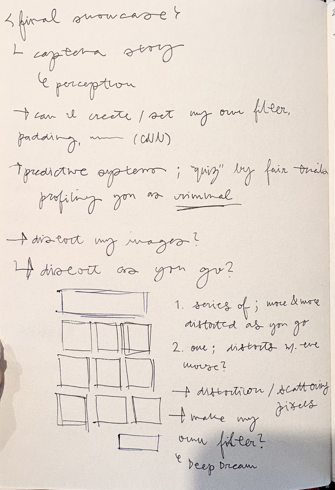 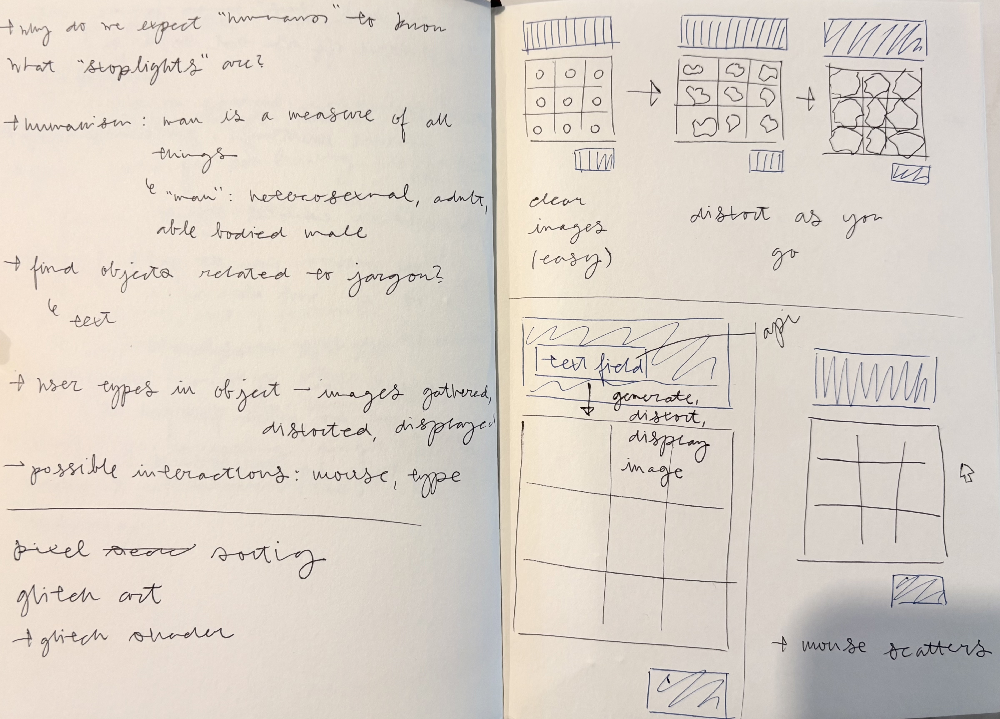

Above are sketchbook entries of brainstorming and drawing thumbsnails. I was largely inspired by the lectures regarding how computers "see" and process images. I came up with three possible projects: 
1. A series of CAPTCHAs with images getting more and more distorted as you go
2. Text field and mouse interaction so that users can designate the object for image recognition
3. A CAPTCHA with image pixels scattering with mouse movement 

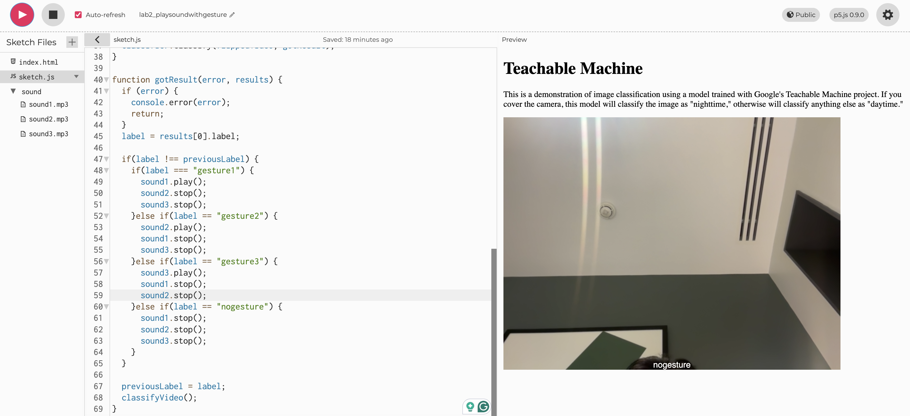 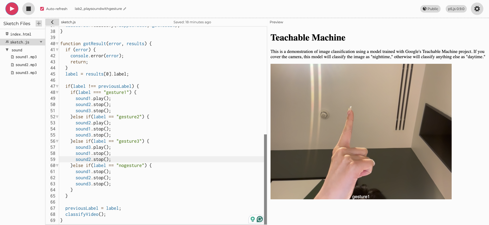 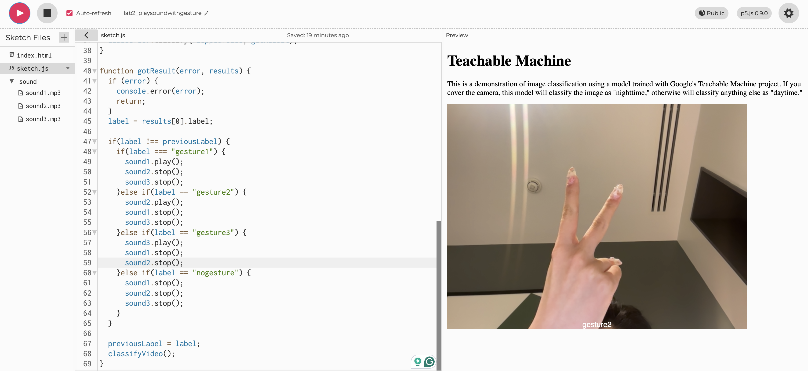 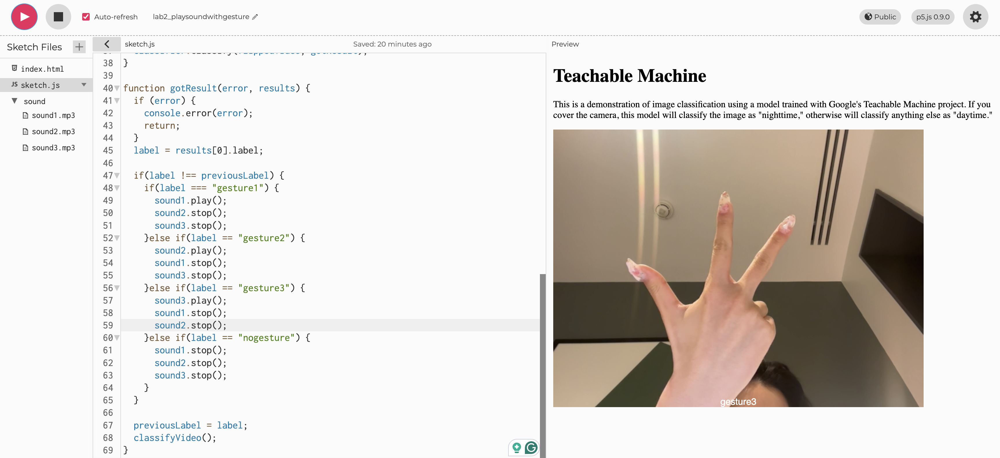 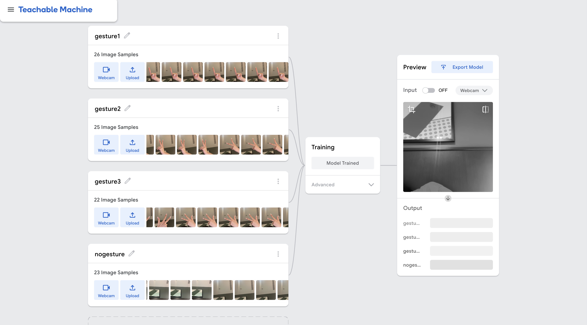 

Lab 2: I am not too sure if I completed this task correctly due to my absence. I duplicated and used the example in the class GitHub to code online in p5.js.0.9.0

[My code](https://editor.p5js.org/leechaeing/sketches/2It4vko5e) uses [this model](https://teachablemachine.withgoogle.com/models/MfoGVr4Ev/) I trained in Teachable Machine. I found very short 5-to 8-second sounds on [Pixabay](https://pixabay.com/sound-effects/) to code with my model. I trained a similar model before using gestures one, two, and three. This time, though, I added more images in quantity and variety for data. Similar to before, this model had trouble identifying one of the gestures: this time, three. Because I coded so that other sound files would stop once one of them started playing, the resulting sounds were glitchy and staccato-like. It reminded me of my experience exploring Infinite Drums: when I was moving my cursor randomly to find sounds.

## Day 9 (2026/07/13)

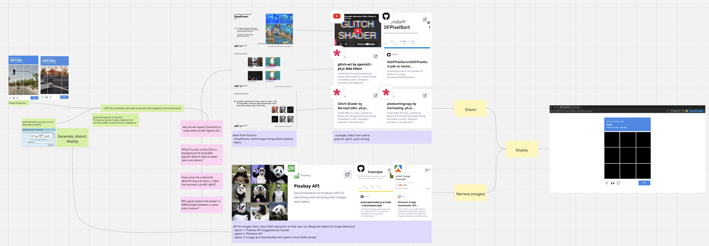

This is a [Miro Board](https://miro.com/app/board/uXjVH8Mbjw8=/?share_link_id=762274866372) I used to brainstorm and plan my final project.

I spent the day looking at the API and image distortion options. I decided to go with Idea 2 as the general concept: one CAPTCHA with possible object options. To let the user choose the topic for image recognition, I would need an API to retrieve different images. Claude suggested Pixabay, and I looked into Pinterest with Marysia; however, they all seem pretty difficult to use. For now, I am experimenting with downloaded images in my local folder.

To make my own filter, or image distortion, I was exploring a few different options like [pixel sorting](https://editor.p5js.org/leechaeing/sketches/r7v9spl8b), [glitch art](https://editor.p5js.org/sjanicki3/sketches/cYMKFGtjX), and [glitch shader](https://editor.p5js.org/BarneyCodes/sketches/XUer03ShM). All these examples I found were in older p5.js versions, so I also spent some time both moving it to Visual Studio Code, referencing previous in-class works for async/await functions, and experimenting with the images I was gonna use. Also, I wanted to run the code and final project in the new p5.js version because I want to reference back to it later on in my studies and possibly add to it as I advance my coding skills.

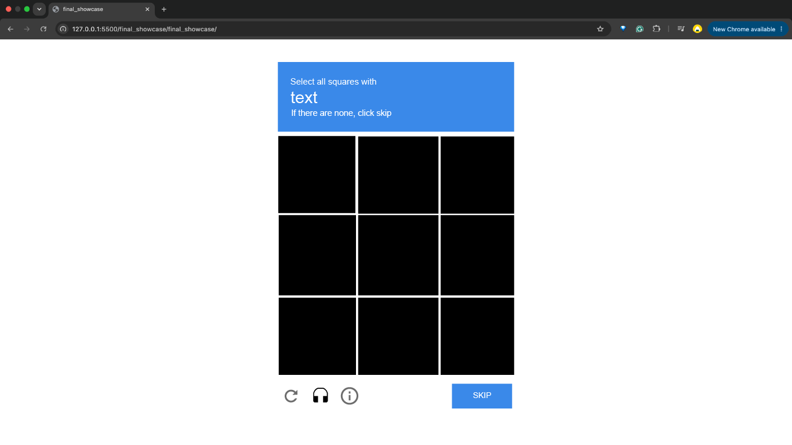 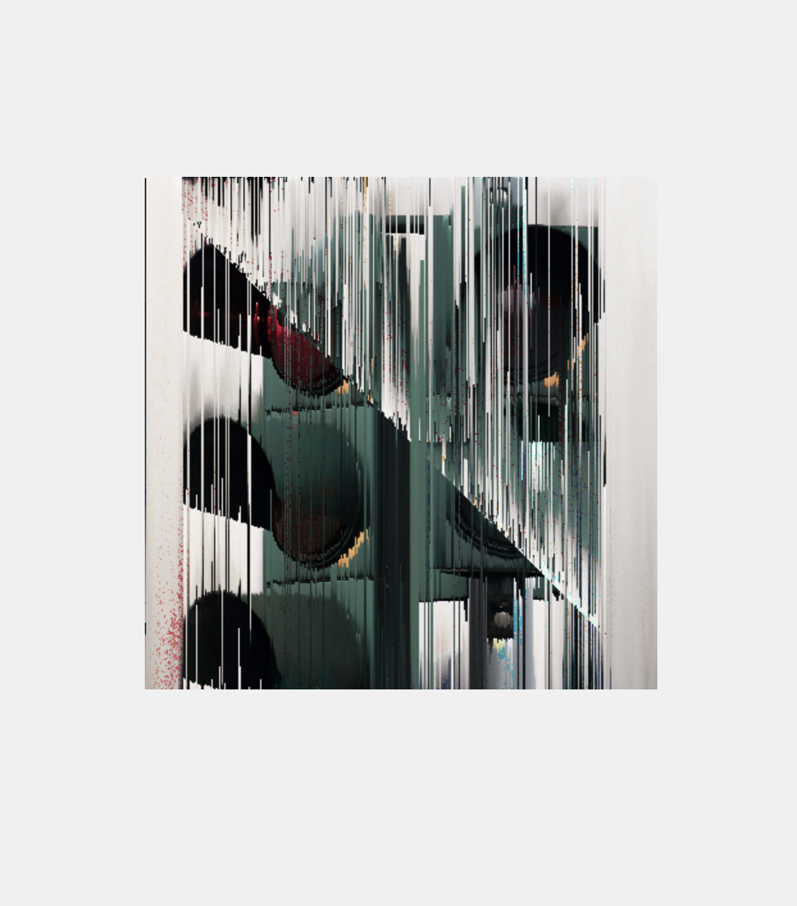

In Adobe Illustrator, I recreated the final layout to create my own interface graphics.

https://glitchology.com/pixel-sorting/
- Pixel sorting foundational glitch art technique
- Image-altering algorithm that uses brightness, hue, or saturation to reorder pixels 
- Popularized by [Kim Asendorf](https://kimasendorf.com/), who sorts twice: vertically then horizontally in his [example code](https://github.com/kimasendorf/ASDFPixelSort/blob/master/ASDFPixelSort.pde)
- Intervals used instead of whole row or column; starts and ends when pixels exceed a certain threshold 
- Each interval has its pixels extracted, computed, and sorted 
- Can sort by brightness, hue, or saturation 

This is just the first draft and general outline code for the image distortion I will be doing in the final project. However, the code is already slightly slow, so I am worried about when I will run it nine times for the nine squares in my CAPTCHA. In addition, I found out that there aren't really limits to the number of images I can have in my assets folder. There are some constraints, though, such as that I cannot be loading hundreds, and that fewer pixels or small file sizes are recommended for more images. The code is already long and slow with just one 400 by 400 px image, and the distortion gets less obvious with fewer pixels. 

## Day 10 (2026/07/14)

## Day 11 (2026/07/15)

## Day 12 (2026/07/16)
